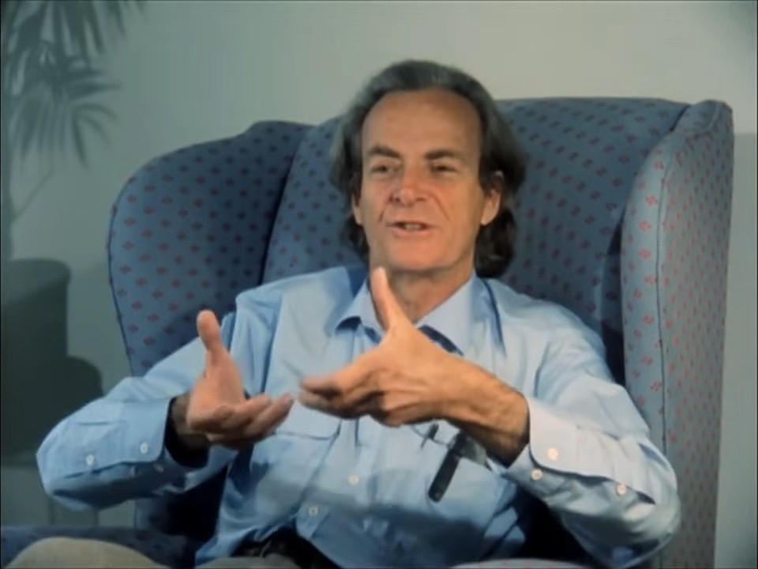

# Feynman Live

A Zoom-style daily one-on-one video call with an AI tribute to **Richard Feynman** (1918–1988).
Bring physics or just life — he answers like a friend who won't let you fool yourself.

**Live: https://feynman-live.netlify.app**



## Features

- **Hands-free voice conversation** — join the call and just talk. Continuous speech
  recognition with live transcription, automatic turn-taking, and barge-in: start
  speaking while he's talking and he stops to listen. His own voice is filtered out
  of the mic via token-overlap echo detection.
- **He answers with voice** — free Microsoft neural TTS proxied through a Netlify
  function (`/api/tts`), with per-sentence captions; optional ElevenLabs voice.
- **Real AI, zero setup** — a server-side proxy (`/api/chat`) talks to Claude or
  Gemini with keys kept in Netlify env vars; visitors configure nothing. A personal
  Claude API key can be set in-app (stored in localStorage) and takes priority.
- **Call UI** — active-speaker glow, audio bars, live captions (CC), in-call chat
  transcript, call timer, mute toggle, EN/中 voice-input switch. Chinese in,
  Chinese out — voice included.
- **A daily curiosity** — he opens each day's call with one of twenty rotating
  Feynman-style questions (why mirrors flip left-right, where trees come from…).

## Stack

React + Vite + Tailwind v4, Web Speech API (recognition), `msedge-tts` in a
Netlify function (speech), Claude / Gemini via serverless proxy. No database,
no accounts.

## Develop

```bash
npm install
netlify dev   # functions (/api/tts, /api/chat) need the Netlify dev server
```

`npm run dev` also works for UI-only work (voice falls back to system TTS,
chat falls back to demo lines unless a personal API key is set in Settings).

## Deploy

```bash
npm run build
netlify deploy --prod --dir dist
```

## Credits

- Avatar: still from the BBC interview *Fun to Imagine* (1983) — personal tribute use.
- Fallback portraits: Tamiko Thiel, 1984 (CC BY-SA 3.0) and Caltech, 1988 (public
  domain), via Wikimedia Commons.
- This is an affectionate, clearly-labeled AI recreation of Feynman's spirit, built
  for personal daily use. He'd tell you himself: he's an AI doing its best impression.
